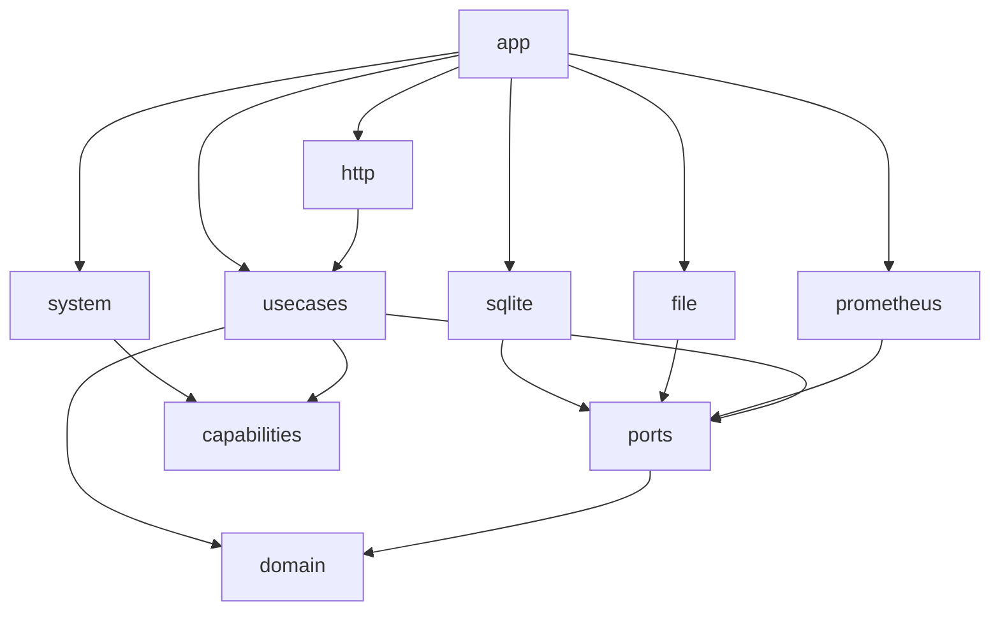

# Capability boundaries and living-doc knowledge ownership

> Standard: [Agentic Engineering Standards](https://github.com/Adobe-AIFoundations/agentic-workflow-standards) v1.2.0.
**Date:** 2026-09-26

Split the backend's `domain/` into types, use cases, business ports, and generic capabilities; name persistence adapters by technology; rename `Plants`/`Operations` to close a naming gap; and stop living docs from enumerating concrete classes or packages, so none of this — or a future rename or a new adapter — requires a doc edit.

## What & Why

- Today: `domain/` mixes pure types, orchestration services (`Plants`, `Operations`, `PlantAttentionMonitor`, `SubstrateCatalog`, `PesticideCatalog`), business-facing ports (`*Store`, `*MetricsApi`), and generic infrastructure capabilities (`Clock`, `IdGenerator`, `Logger`, `PlantUpdateLock`) in one package tree. `adapters/persistence/` and `adapters/storage/` name a category and an accident of history, not the technology each adapter is. Separately, `specs/contracts.md` and `ci/specs/contracts.md` enumerate individual port/adapter/pipeline-function files, which goes stale on every rename — confirmed twice this review: a `capabilities/` directory the docs describe but the code doesn't have, and a `ci/specs/contracts.md` table naming two Dagger functions that don't exist while omitting the one actually used.
- New: `domain/` (pure types only), `usecases/` (five orchestration services — `PlantManager` and `OperationLedger`, renamed from `Plants`/`Operations` to match the entity+role-suffix pattern the other three already use; `PlantAttentionMonitor`, `SubstrateCatalog`, `PesticideCatalog` unchanged), `ports/` (business-external dependencies with a real adapter — stores, metrics), `capabilities/` (generic cross-cutting infrastructure — time, identity, logging, locking), as siblings. `adapters/persistence/` → `adapters/sqlite/`; `adapters/storage/` → `adapters/file/`. Living docs stop naming individual classes or files for internal architecture; they name the owning package and point to it.
- The SDD skill's spec gate changes from "every product change" to "any change that adds or revises durable knowledge a living doc should record." A pure internal refactor with no such knowledge doesn't require one. The maintainer may waive the requirement explicitly for anything; an agent must not decide to skip it unilaterally.

## Domain / Design Notes

**Backend package shape:**

```
domain/          pure types — ADTs, value objects, invariants
usecases/        orchestration services, one entity + role suffix each:
                   PlantManager (was Plants), OperationLedger (was Operations),
                   PlantAttentionMonitor, SubstrateCatalog, PesticideCatalog
ports/           business-external dependencies, each with a real adapter:
                   every *Store, every *MetricsApi
capabilities/    generic infrastructure, not business-specific:
                   Clock, IdGenerator, Logger, PlantUpdateLock
adapters/
  http/          unchanged
  sqlite/        was persistence/ — every SQLite-backed store adapter
  file/          was storage/ — the photo-content adapter
  prometheus/    unchanged
  system/        unchanged — Clock/IdGenerator capability adapters
app/             unchanged (composition root)
```

- A port is a business-domain-specific external dependency (a store, a metrics sink); a capability is generic infrastructure any service could need regardless of business logic (time, identity, logging, mutual exclusion). Whether something happens to have a swappable adapter isn't the test — `Clock`/`IdGenerator` have one (`adapters/system/`) and are still capabilities, not ports.
- Behavior and public signatures of all five use-case services are unchanged. `Plants`→`PlantManager` and `Operations`→`OperationLedger` close the naming gap with the other three's entity+role pattern; every package moves.
- `PlantsMetricsApi`/`OperationsMetricsApi` rename to `PlantManagerMetricsApi`/`OperationLedgerMetricsApi` in lockstep — every other `*MetricsApi` port is already named after its owning use case, not the bare entity (`PlantAttentionMonitorMetricsApi`, `SubstrateCatalogMetricsApi`, `PesticideCatalogMetricsApi`), so these two must track the rename to stay consistent. `*Store` ports are unaffected: they're already named after the entity (`PlantStore`, `SubstrateStore`), not the use case, matching the other four.

**Living-doc knowledge-ownership rule**, added to `specs/templates/README.md`'s rules for every living doc: point to the owning package or directory, never enumerate the classes or files inside it. A living doc describes what a boundary is for and where it lives, not its current membership.

Consequences applied here:

- `specs/contracts.md` keeps only genuine cross-boundary contracts — HTTP/OpenAPI, the WebSocket feed, `/metrics` exposition, Flyway migrations as a directory — and drops the per-file use-case/port/capability rows. Those are internal architecture, not a contract with an independently-evolving consumer; the package split itself is a `design.md` fact.
- `ci/specs/contracts.md` becomes the contract between the external CI runner (GitHub Actions today) and this codified pipeline: the `dagger call` invocations and arguments the workflows actually make (`changed`, `verify`, `release-version`, `publish`), sourced from the workflow files — not an inventory of every internal Dagger function, which `.dagger/src/index.ts` is already the source of truth for. This also drops `release-guard`/`deploy`, neither of which exists.
- DESIGN-PRINCIPLES.md and CONTRIBUTING.md describe `adapters/` by example ("one subpackage per external dependency, e.g. `http`, `sqlite`") instead of enumerating all five.

**Dependency direction**, mechanically enforced by extending the existing ArchUnit suite (`ArchitectureComponentTest`, today checking only that `domain` doesn't depend on `adapters`/`app`) rather than review discipline alone:



- `domain/` has no outgoing dependency at all — not on `ports/`, `capabilities/`, `usecases/`, `adapters/`, or `app/`.
- `capabilities/` has no outgoing dependency either, not even on `domain/` — verified today: `Clock` returns `Instant`, `IdGenerator` returns `String`, `Logger` takes `String`, `PlantUpdateLock` is generic; none references a domain type.
- No adapter depends on another adapter. `adapters/http` depends only on `usecases/`, never reaching past it to `ports/` or `capabilities/` directly.

## Alternatives Considered

- A `ports/driving` package for the use-case trait signatures: rejected — this codebase doesn't model anything as a driving port (the only thing driving the system is HTTP calling in directly); the use-case interfaces already are the entry point, and stay with their implementation in `usecases/`.
- `OperationManager`, parallel to `PlantManager`: rejected — an Operation, once logged, is immutable except its kind-specific details (GLOSSARY: "does not change after logging"); `Ledger` names that append-mostly, historical-record shape, which `PlantManager`'s CRUD lifecycle doesn't share.
- Keeping `ci/specs/contracts.md` as a full internal Dagger function inventory: rejected — an internal function isn't a contract with an external party, and the table has already gone stale twice. The workflow-invocation framing is the part that actually breaks something if it drifts.

## Invariants

- Every fact lives in exactly one document, per CONTRIBUTING.md's existing rule ("never repeat a fact — state it once, in one place"). This change touches many docs at once; none of its edits may introduce a second statement of a fact another living doc, `specs/templates/*`, or the code itself already states.

## Acceptance Criteria

- `domain/` contains only types; `usecases/` contains `PlantManager`, `OperationLedger`, `PlantAttentionMonitor`, `SubstrateCatalog`, `PesticideCatalog` — public signatures and behavior unchanged from today's `Plants`/`Operations`; `ports/` contains every `*Store`/`*MetricsApi`; `capabilities/` contains `Clock`, `IdGenerator`, `Logger`, `PlantUpdateLock`; no file under `domain/` threads a capability via `using`.
- No production or test reference to `Plants`/`Operations`/`PlantsMetricsApi`/`OperationsMetricsApi` remains; test suites are renamed to match (`PlantsComponentTest` → `PlantManagerComponentTest`, etc.), per CONTRIBUTING's `<Component>ComponentTest` convention.
- `adapters/persistence/` and `adapters/storage/` no longer exist; their contents live under `adapters/sqlite/` and `adapters/file/`.
- `specs/contracts.md` and `ci/specs/contracts.md` contain no link to an individual port, capability, use-case, or adapter source file; `ci/specs/contracts.md`'s inventory is keyed to the workflow-invoked `dagger call` commands, not the internal function list.
- DESIGN-PRINCIPLES.md and CONTRIBUTING.md name `ports/` and `capabilities/` as real, distinct directories and describe `adapters/` without enumerating its subpackages.
- README.md lists every top-level doc and directory meant for a reader to find, including `unraid/` and `grafana/`.
- CONTRIBUTING.md's backend gate command matches AGENTS.md's compile-once ordering.
- AGENTS.md and the SDD skill state that a spec is required only when the change adds or revises living-doc knowledge, and that only the maintainer may waive it.
- All existing backend/frontend/pipeline tests pass with unchanged assertions; gates stay green.
- `ArchitectureComponentTest` is extended with a rule per forbidden edge above and fails the build on a violation.

## Doc Sync

- `specs/design.md` — Architecture constraints: the four-package backend split (`domain`/`usecases`/`ports`/`capabilities`); a port is a business-external dependency, a capability is generic infrastructure, independent of whether either has a swappable adapter; the dependency-direction diagram and which edges are forbidden.
- `specs/contracts.md` — Contract inventory: drop the per-file use-case/port/capability rows; keep only HTTP/OpenAPI, WebSocket feed, `/metrics`, and Flyway migrations.
- `ci/specs/contracts.md` — Contract inventory: replace the internal Dagger function table with the CI-runner-facing invocations (`changed`, `verify`, `release-version`, `publish`) and their arguments; point to `.dagger/src/index.ts` for the internal function list instead of enumerating it.
- `ci/specs/operational.md` — Versioning & release provenance: `release-guard` → `release-version` plus the inline release-tag check inside `publish`.
- `DESIGN-PRINCIPLES.md` — §1 Ports & Adapters: distinguishes `ports/` (business-external dependencies) from `capabilities/` (generic infrastructure); adapters described by example, not enumeration. §6 Strict Build Guardrails: dependency direction across all five packages is checked by the existing ArchUnit suite, not review discipline alone.
- `CONTRIBUTING.md` — repo-map row for `backend/`: `domain`, `usecases`, `ports`, `capabilities`, `adapters`, `app`, no adapter-subpackage enumeration; backend gate command reordered to match AGENTS.md.
- `README.md` — index lines for `unraid/`/`grafana/`.
- `AGENTS.md` — "How work happens here": spec required only when living-doc knowledge changes; maintainer-only waiver.
- `.agents/skills/sdd/SKILL.md` — Phase 1 gate: the knowledge-based spec-requirement criterion and the maintainer-waiver clause.

## Out of Scope

- `guides/*.md` content contradictions (lavender recipe, `layout.md` species/zone errors) — excluded from this pass.
